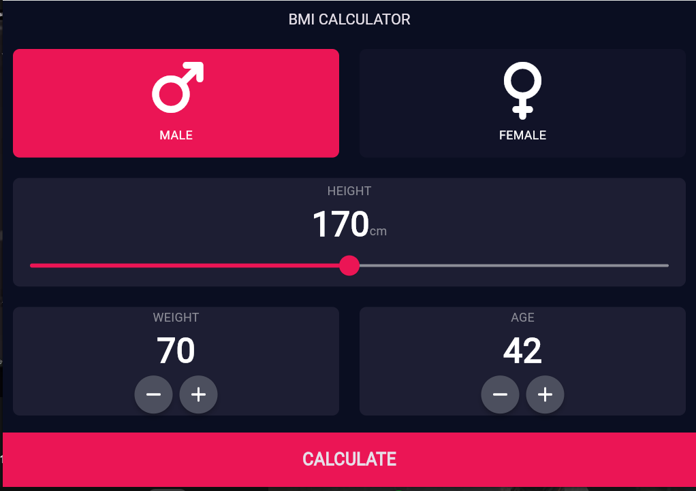
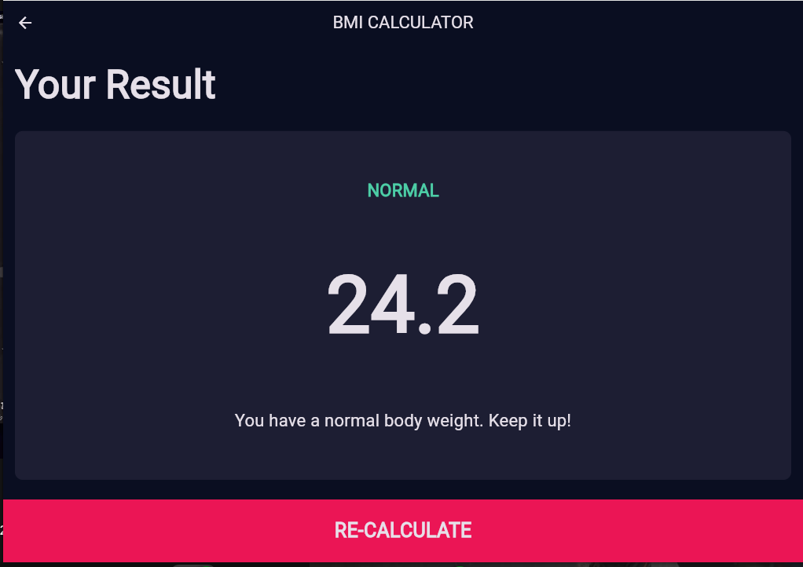

# BMI Calculator 🏋️‍♂️

A sleek, modern, and responsive Body Mass Index (BMI) calculator built with **Flutter**.

## 🚀 Features
- **Custom UI Widgets:** Hand-crafted reusable components.
- **Interactive Height Slider:** Smooth selection using `SliderTheme`.
- **Health Logic:** Accurate BMI calculation with feedback.
- **Responsive Layout:** Works on Mobile and Web.

## 📸 Screenshots

  
  

## 🛠️ Built With
- **Framework:** [Flutter](https://flutter.dev/)
- **Language:** [Dart](https://dart.dev/)
